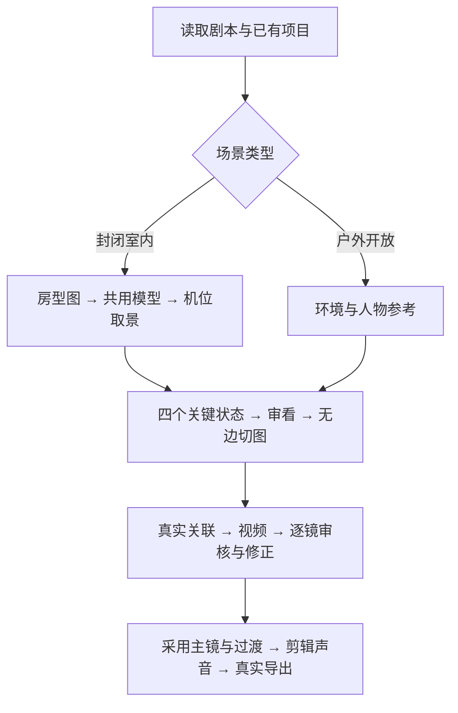

# 工作流归纳与空间一致性改进

更新：2026-10-07。本次归纳已有制作经验、修订技能与更新软件技能库；既有成片和采用资产保持原状态。

## 场景分类和执行顺序

封闭室内：采用或生成房型图 → 建立/复用同一个空间模型 → 登记机位并检查真实取景 → 制作关键图和视频。户外开放场景使用环境、人物及必要道具参考，按剧情正常拆镜；不强制额外房型或建模。

前置配置、授权和实际模型能力就绪后，后续调用者以剧本为主要输入，由 Agent 自主安排普通创作细节并执行检查；不把本片的身份、时长、镜头数或并发数套给其他影片。

## 解决 5 米变 10 米的问题

记录同一人物脚底锚点与同一桌沿锚点、世界单位、模型版本及机位。生成前核对真实坐标：人物未走动、桌子未搬动时，换景别后仍是 5 米。人物实际走远才更新间距，并记录可走路线、时间和新位置。摄影机、焦段和裁切可以改变透视观感，不能扩大房间来迁就构图。

取景图、四格与视频另作内容检查。单幅未标定的 AI 图不能证明精确米数，模型坐标检查也不能自动证明生成结果正确。执行细节见 [空间距离与连续性](../skills/yingce-film-production/references/spatial-distance-continuity.md)。

## 归纳的制作规则

- 门洞、家具位置与尺寸、桌面道具身份/材质/承托物沿用采用版本；转身、视线、行走路线和持物变化要有剧情依据。
- 四宫格表达四个关键事件，逐格有新信息；前镜末态衔接后镜，后镜首格推进行动。过渡也要检查并实际进入时间线。
- 首帧用本镜独立切图1；切图4的尾帧用途按渠道支持决定。母图不充当视频首尾帧。图片按真实身份去重，四张阶段图按顺序关联，额外参考按实际需要及渠道上限配置。
- 提示词在原生输入框，用可显示缩略图的真实智能引用，放在对应动作段。镜号/阶段标题、容器归属、切图和视频独立排列都要核对。
- 白边与分割线都排除在切图内容外。失败的图片不再引导后续；清理失败/无用节点时保留真实任务与资源证据。
- 每次失败留下镜号、时刻、具体错误、应有状态及原因证据；未解决问题累计进入下一版纠正。查询超时先查原任务，明确终态失败按既有授权重试。
- 视频检查画面、时长、顺序、台词完整性和实际声音。ASR 或音轨存在不能证明音质、口型通过。候选并发按最新要求；同一画布的写入使用最新版本，按剧情依赖审核采用。

完整执行方法见 [剧本到成片自动化工作流](../skills/yingce-film-production/references/script-to-film-automation.md)，确认使用 H3 时才读取官方 H3 提示词技能与本地适配。

## 本次检索的来源

已查阅 [Higgsfield Camera](https://github.com/OSideMedia/higgsfield-ai-prompt-skill/blob/main/skills/higgsfield-camera/SKILL.md)、[Pipeline](https://github.com/OSideMedia/higgsfield-ai-prompt-skill/blob/main/skills/higgsfield-pipeline/SKILL.md) 和 [MiniMax 官方 H3](https://github.com/MiniMax-AI/MiniMax-H3/tree/main/skills/h3-prompt-writing)，采用镜头运动、阶段依赖和参考用途的描述方法。

另查阅 [MCP for Blender](https://github.com/ahujasid/mcp-for-blender) 的三维场景操作方式，以及 [NVIDIA GEN3C](https://research.nvidia.com/labs/toronto-ai/GEN3C/) 的三维缓存/摄影机轨迹约束。它们提供进一步方案依据；本次没有安装 Blender MCP 或接入 GEN3C，优先复用衍图现有空间模型能力。

## 新版实际生效记录

整片技能已通过本机原生包更新接口从软件有效版本 1.2.0 更新为 **1.5.0**，保留同一个 skillId 与旧版本历史。`skill_catalog`、`skill_search` 和三份 `skill_read` 完整返回均指向新版本；搜索“空间”能找到该技能，新增参考内容已读回。

技能 ID：`c85a288da84a24aa8174042d0d61d1a4`；新版本 ID：`2e7afe25f6bf397d6fee9a2158b5749a`。

本地技能、便携插件、当前插件缓存、辅助技能与迁移副本同步更新。更新已锁定的制作运行时需单独处理受影响依赖；发布规则不会替换已有采用媒体。文件和 MCP 回读记录见 [更新清单](file-update-record.json)、[软件更新结果](software-skill-update.json) 与 [MCP 实际读回](mcp-skill-readback.json)。

本次未运行软件测试，也未提交新的付费生成。核对范围是规则内容、文件同步、实际技能版本和 MCP 可读性；没有把规则更新冒充全流程成片验证。
